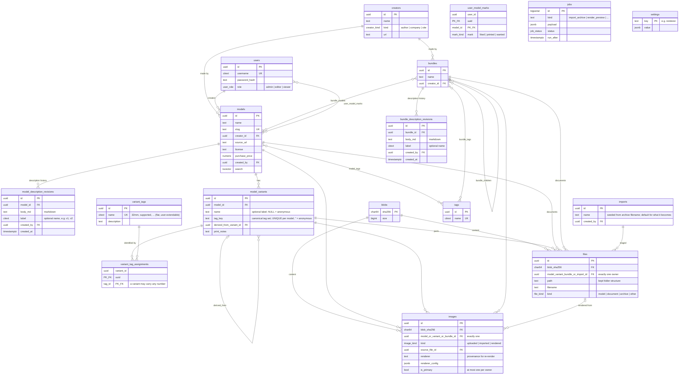
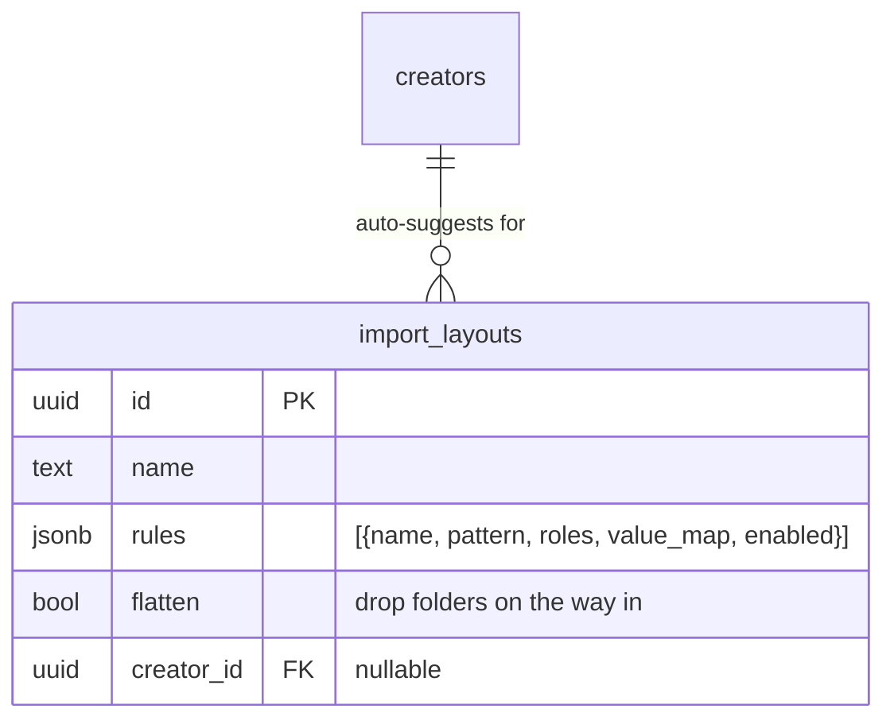

# MeshTrove — Design

## Context

MeshTrove (working title in the original spec: "MySTL") is a self-hosted
Printables/Thingiverse-style archive for downloaded **and
purchased** 3D models: one central place for models, their variants, files, print
notes, images, and bundles. Backend is Rust/Axum/SQLx (Postgres, with migrations);
frontend is React/TypeScript/MaterialUI via Vite, structured per
`docs/PROJECT_TEMPLATE.md` (single binary serves prod static files or dev-proxies
to Vite; no CORS; clap config with env/flag duality).

This is the **living design doc** — schema, search, architecture, API surface,
and feature designs, kept current as the code moves. Companions:
`docs/decisions.md` (decision log + build status), `docs/import-layouts.md`
(real archive shapes the import flow must cope with), `docs/spec.md` (the
original prompt, historical).

### Decisions made with the user

0. **Name**: **MeshTrove**. Crate/binary `meshtrove`, env-var prefix `MESHTROVE_`,
   default DB name `meshtrove`. (The repo directory is still `mystl`; renaming it
   is up to the user.)

1. **Storage**: content-addressed filesystem blob store (`store/ab/cd/<sha256>`),
   behind a `BlobStore` trait so S3 can be swapped in later. Postgres owns all
   metadata including logical folder structure. Dedup falls out of hash-keying.
2. **Tags vs variants**: two separate systems with two separate vocabularies,
   unified at the search API. Tags are free-form labels on models/bundles; a
   **variant is the set of variant tags its files carry** — a structured child of
   a model whose identity is that set, not its name. Variant tags are **not
   hard-coded columns or enums** but a flat declarable vocabulary (32mm, 75mm,
   unsupported, supported, lychee_project, …, all only seed rows), and a variant
   may carry any number of them. A variant with none is the model's one
   **anonymous** variant: files separated out without an explicit variant tag. A
   search like `tags=egypt,undead & vtags=32mm,unsupported` filters models by
   tags and variants by their tag sets.
3. **Scope**: "core archive first" — the **full** schema landed in migration
   0001 (including jobs, bundles, tags, marks, settings, so it reviewed as a
   whole); later migrations extend it (0002 bundle search, 0003 imports,
   0004 flat variant tags). Build status per feature: `docs/decisions.md`.
4. **Rendering**: shell out to an external tool (f3d first) from a background job —
   no in-project mesh parser/renderer. The renderer command is an **admin-global
   setting**; changing it affects only new renders. Each rendered image records
   the renderer + config that produced it, so an admin can bulk re-render
   "everything still on the previous renderer", choosing **add** (keep old image)
   or **replace**.

## Database schema (migrations `0001`–`0004`)

### Entity-relationship diagram



### Table definitions

Postgres, `uuid` PKs (`gen_random_uuid()`), `timestamptz` everywhere, `citext` for
case-insensitive uniques. Enums as Postgres `CREATE TYPE`.

```
-- auth
users            id, username citext UNIQUE, password_hash (argon2id),
                 role user_role ('admin'|'editor'|'viewer'), created_at
                 -- login via signed PrivateCookieJar; no sessions table

-- provenance
creators         id, name, kind creator_kind ('author'|'company'|'site'),
                 url, notes, created_at
                 -- e.g. Loot Studios (company), Printables (site), an author

-- core catalogue
models           id, name, slug UNIQUE, creator_id FK NULL,
                 source_url, license text NULL,
                 purchase_price / purchase_date / order_ref NULL,   -- bought models
                 created_by FK users, created_at, updated_at
                 -- description lives in revisions (below); search tsvector over
                 -- name + current revision body, maintained by trigger + GIN index

-- markdown descriptions with full edit history; every save is a new immutable
-- revision (current = newest), optionally nameable ("v1", "v2").
-- Models and bundles get identical treatment.
model_description_revisions
                 id, model_id FK, body_md text, label citext NULL,
                 created_by FK users, created_at
                 UNIQUE (model_id, label) WHERE label IS NOT NULL
bundle_description_revisions
                 id, bundle_id FK, body_md text, label citext NULL,
                 created_by FK users, created_at
                 UNIQUE (bundle_id, label) WHERE label IS NOT NULL

-- A variant IS its tag set. `name` is a label; `tag_key` is the identity.
model_variants   id, model_id FK, name NULL,      -- NULL name = anonymous variant
                 tag_key text,                    -- canonical tag set, by trigger
                 derived_from_variant_id FK NULL, -- user-made variants point at origin
                 print_notes text NULL,           -- per-variant print settings/notes
                 created_by, created_at
                 UNIQUE (model_id, tag_key) DEFERRABLE,  -- one variant per tag set,
                                                 -- so one anonymous variant (key '')
                 UNIQUE (model_id, name) WHERE name IS NOT NULL

-- variant attributes: a FLAT declarable vocabulary (no hard-coded enums, and no
-- axis/value split — a variant may carry 'stl' AND 'obj')
variant_tags            id, name citext UNIQUE, description NULL, created_at
variant_tag_assignments (variant_id, tag_id) PK
-- variant_tag_key(uuid[])       -- canonical (sorted) rendering of a tag set
-- merge_duplicate_variants()    -- same tag set = same variant: fold, don't fail
-- migration seeds (from the retired axes): 32mm, 75mm, unsupported, supported,
-- supported_hollow, lychee_project, merged — editable/extendable data

-- content-addressed storage
blobs            sha256 char(64) PK, size bigint, created_at

files            id, blob_sha256 FK blobs,
                 model_id / variant_id / bundle_id / import_id
                                  -- exactly one non-null (num_nonnulls CHECK)
                 path text        -- kept folder structure ('' = root)
                 filename text, mime text,
                 kind file_kind ('model'|'document'|'archive'|'other'),
                 created_at
                 -- variant files = the printable parts; model/bundle files =
                 -- associated documents (stat guides, painting guides, magazines);
                 -- kind='archive' keeps the original uploaded zip for provenance.
                 -- Duplicate discovery = files joined on shared blob_sha256.

-- the staging area for dropped archives (migration 0003; see Imports below)
imports          id, name,        -- seeded from the archive filename; editable,
                                  -- default name for the model/bundle it becomes
                 created_by FK users, created_at, updated_at
                 -- never in browse/search; commit moves its files onto one
                 -- owner and deletes the row (files cascade)

images           id, blob_sha256 FK,
                 model_id / variant_id / bundle_id  -- exactly one non-null (CHECK)
                 kind image_kind ('uploaded'|'imported'|'rendered'),
                 source_file_id FK files NULL,      -- what a render was made from
                 renderer text NULL, renderer_config jsonb NULL,  -- provenance for re-render
                 width, height, is_primary bool, sort_order, created_by, created_at
                 -- images attach to models, VARIANTS, or BUNDLES alike; the
                 -- "Primary" image (used for preview cards) is enforced as at
                 -- most one per owner via partial unique indexes:
                 --   UNIQUE (model_id)  WHERE is_primary,
                 --   UNIQUE (variant_id) WHERE is_primary,
                 --   UNIQUE (bundle_id) WHERE is_primary
                 -- (setting a new primary clears the old one in the same txn)

-- bundles (purchasable packs AND personal uber-bundles)
bundles          id, name, slug, creator_id FK NULL, source_url, created_by,
                 timestamps
                 -- description lives in bundle_description_revisions, same
                 -- pattern as models; images via images.bundle_id; migration
                 -- 0002 added a search tsvector (mirrors models) for /api/browse
bundle_models    (bundle_id, model_id) PK
bundle_children  (parent_bundle_id, child_bundle_id) PK, CHECK parent<>child

-- tagging
tags             id, name citext UNIQUE
model_tags       (model_id, tag_id) PK
bundle_tags      (bundle_id, tag_id) PK

-- user marks (schema now, UI follow-up)
user_model_marks (user_id, model_id, mark mark_kind ('liked'|'printed'|'wanted')) PK,
                 notes NULL, created_at

-- background jobs
jobs             id bigserial, kind text, payload jsonb,
                 status job_status ('queued'|'running'|'succeeded'|'failed'|'cancelled'),
                 priority int, attempts int, max_attempts int, last_error text,
                 run_after timestamptz, started_at, finished_at, created_at
                 INDEX (status, priority, run_after)

-- admin-global settings
settings         key text PK, value jsonb, updated_at, updated_by
                 -- e.g. 'renderer' → {"tool":"f3d","args":[…]}
```

## Search design (unified text + tags + variant tags)

One query shape (`?q=&tags=&vtags=`, all CSV) resolved by a single SQL query in
Postgres — no external search engine. `GET /api/models` searches models;
`GET /api/browse` UNION ALLs bundles in (migration 0002 gave `bundles` the same
`search` tsvector), ranked and paginated together — a `vtags` filter excludes
bundles, since only variants carry variant tags.

- **Full text**: a `search tsvector` column on `models`, GIN-indexed, maintained
  by triggers and built with weights from everything a user would call "the
  model's text": name (weight A), tag names (B), creator name (B), and the
  **current** description revision's markdown (C, tags stripped). Triggers on
  `models`, `model_description_revisions` (insert = new current), `model_tags`,
  and `creators` keep it fresh; no application code has to remember to reindex.
  Queries use `websearch_to_tsquery('english', $q)` (supports quoted phrases,
  `-exclusions`) and rank with `ts_rank`.
- **Fuzzy/prefix match**: `pg_trgm` GIN index on `models.name` (and `tags.name`)
  OR-ed in, so misspellings ("anubus") and substring hits still match; also
  powers typeahead for tag and creator comboboxes.
- **Tags**: AND semantics — each requested tag becomes an `EXISTS` against
  `model_tags` (names resolved case-insensitively via `citext`).
- **Variant tags**: each `vtags` name filters via a single `EXISTS` requiring
  **one variant that carries all requested tags at once** (a model with a
  32mm+supported variant and a 75mm+unsupported one does NOT match
  `32mm + unsupported`); the response marks which variants matched so the UI can
  highlight them.
- All filters compose as `AND` in one statement; ordered by `ts_rank` when `q`
  is present, else `updated_at DESC`; paginated. Filter-sidebar counts come from
  a grouped facet query over the same predicates.

## Architecture

Follow `docs/PROJECT_TEMPLATE.md` closely:

```
backend/
  src/main.rs          logging, dotenvy, AppState::new, router, worker spawn, serve
  src/config.rs        Arguments (clap, every field flag+env) → Configuration
                       DATABASE_URL, STORE_DIR (default ./store), COOKIE_KEY(+_FILE,
                       required ArgGroup), BIND_ADDR, --dev/VITE_URL/STATIC_DIR,
                       --anonymous (dev auth short-circuit), --create-admin user:pass
  src/state.rs         AppState { config, db: PgPool, store: BlobStore }
  src/extractors.rs    User extractor: PrivateCookieJar → users row; role checks;
                       anonymous short-circuit in dev
  src/routes/
    api.rs             /api/* (utoipa spec, swagger at /docs)
    auth.rs            /auth/register, /auth/login, /auth/logout
    frontend.rs        catch-all: static serve (SPA fallback) or Vite proxy + WS HMR
  src/services/
    blobstore.rs       trait BlobStore { put(stream)->sha256, get(sha)->stream, delete };
                       FsBlobStore: write to tmp, hash while streaming, rename into
                       store/ab/cd/<hash>; GET with range support
    jobs.rs            enqueue(); worker loop: FOR UPDATE SKIP LOCKED poll, retry
                       with backoff, per-kind dispatch
    importer.rs        import_archive job: unzip → hash → create blobs/files
                       preserving paths → enqueue render_preview per model file
    renderer.rs        render_preview job: read 'renderer' setting, shell out to
                       f3d (`f3d --output <png> <stl>` headless), store PNG blob,
                       insert images row stamped with renderer+config
  migrations/0001_initial.sql
  build.rs             APP_VERSION from git describe
frontend/              Vite + React + TS + MUI + react-router + @tanstack/react-query
docker-compose.yml     postgres:17 (+ volume); store/ is a bind-mounted dir
.env.example
```

## API surface

- `POST /auth/register|login|logout`; `GET /api/me`; `GET /api/version`
- `GET /api/browse` — unified model+bundle search (`?q=&tags=&vtags=`, see
  Search design above)
- `GET/POST/PUT/DELETE /api/creators`
- `GET/POST/PUT/DELETE /api/models` (GET takes the same `?q=&tags=&vtags=` —
  `vtags` is a comma-separated list of variant tag names, all of which one
  variant must carry; the response marks which variants matched)
- `GET/POST/PUT/DELETE /api/variant-tags` — manage the flat variant vocabulary
  (editor+). Variant create/update takes tag *names* and get-or-creates them, so
  the vocabulary grows organically during import; deleting a tag merges any
  variants its removal leaves with identical tag sets
- `POST /api/models/{id}/variants`; `PUT/DELETE /api/variants/{id}` —
  create/update are get-or-create **by tag set**: hitting a tag set the model
  already has returns that variant and merges into it (files and images move
  across), rather than conflicting. Omitting name and tags addresses the
  model's anonymous variant
- `GET/POST/PUT/DELETE /api/bundles` (+ description revisions, as models);
  `POST/DELETE /api/bundles/{id}/models` — membership (`bundle_models` is a
  true many-to-many; a model can span bundles)
- `GET/POST /api/imports`; `GET/PUT/DELETE /api/imports/{id}`;
  `POST /api/imports/{id}/commit` — the staging area (see Imports below)
- `PUT /api/{models|bundles}/{id}/description` (creates a new revision);
  `GET /api/{models|bundles}/{id}/description/revisions` (history);
  `PUT …/revisions/{rev}/label` (name a revision, e.g. "v1")
- `GET/POST /api/{models|variants|bundles|imports}/{id}/files` — multipart
  upload onto any owner; a `.zip` triggers an `import_archive` job (original
  archive kept as kind='archive'); others stored directly, an optional `path`
  field applying to every `file` part that follows it (how folder drops carry
  their tree in one request)
- `PATCH /api/files/{id}` (rekind/move between owners — the manual carve);
  `DELETE /api/files/{id}`;
  `GET /api/files/{id}/download` (streams from blob store, Content-Disposition)
- `GET/POST /api/{models|bundles|variants}/{id}/images` upload;
  `GET /api/images/{id}` (serve); `PUT /api/images/{id}/primary` (mark as the
  owner's preview image, atomically demoting the previous primary)
- `GET/POST /api/tags`; tag assignment on model create/update
- `GET /api/jobs?status=` (visibility into queue); `POST /api/jobs/{id}/retry`
- Admin: `GET/PUT /api/admin/settings/renderer`;
  `POST /api/admin/rerender { scope: "stale", mode: "add"|"replace" }` —
  enqueues render jobs for images whose renderer/config ≠ current setting
- Permissions: viewer = read + marks; editor = edit own models/bundles;
  admin = edit all + settings

## Imports — the staging area

A dropped archive (or folder — `webkitGetAsEntry` tree walk in
`frontend/src/upload.ts`) lands in an **import**: a holding object that is
neither a model nor a bundle, never appears in browse/search, and is listed
only on the *Importing* page. The model-vs-bundle question can't be answered at
drop time — contents aren't unpacked and the filename doesn't say — so the
import defers it by one step, which is what removed "promote to bundle" /
"flatten to model" conversions entirely: models and bundles are fixed kinds.

Once the unpack job finishes, `POST /api/imports/{id}/commit` takes one
destination — **new model**, **new bundle**, or **existing bundle**
(preselected when the drop happened on a bundle page) — and moves every staged
file onto that owner in one transaction, dropping the import row. It refuses
while an unpack is in flight so files can't be stranded. Files land in the
owner's "unsorted" bucket, then get carved by hand (`PATCH /api/files/{id}`):
bundle → member models → variants — or, designed below, by a layout template
at commit time. History and phasing: `docs/decisions.md`.

## Frontend pages (MUI)

**Look & feel: vaguely Printables** (user request). MUI theme with Printables-style
orange primary (~`#FA6831`) on a clean white surface, plus a dark mode variant;
layout mirrors printables.com: top app bar (logo, big centred search, user menu),
model browsing as a dense card grid of large square-ish thumbnails with
name/creator/like-count underneath, and a left filter sidebar on the browse page
(two chip clouds: model tags, and the variant tag vocabulary).

- Login/Register
- Browse: mixed model+bundle card grid, text search, left filter sidebar (two
  chip clouds: model tags, variant tag vocabulary)
- Model detail: image gallery (primary image), rendered-markdown description
  (edit dialog with revision history + "name this version"), variant sections
  with per-variant file tree (rebuilt from `path`), *Unsorted files* section
  (rekind / move into variants / delete), download buttons, print notes, tags,
  creator link
- Bundle detail: description, member models, its own unsorted section carving
  files into member models
- *Importing* list + import page: staged file tree, name, destination toggle
  (one model / new bundle / existing bundle), commit
- Global drag-drop overlay (files, zips, or whole folders → a new import)
- Creators list/detail; Jobs page (queue visibility + retry)
- Admin settings page (renderer config + "re-render stale" button with add/replace)

Deferred work (likes/printed UI, print logs, orphan-blob GC, browser-import
helper, …) is tracked in `docs/decisions.md`.

## Import layout templates — regex-driven carve

The concrete mechanism for Phase 3's "carve" (`docs/decisions.md`; real archive
shapes in `docs/import-layouts.md`). A **layout** is a regex matched
**full-path** (implicitly `^…$`) against each staged file's logical `path`; its
capture groups are assigned **roles**, and the resolved captures turn one flat
import into a proposed models → variants tree, previewed before commit.

Example — Loot layout B:

```
\d+ - ([^/]+)/[^/]+/([^_]+)_(\d+mm)_([^/]+)/[^/]*\.stl
```

| group | example capture | role |
|---|---|---|
| 1 | `Heroes` | model tag |
| 2 | `Gold` | model name |
| 3 | `32mm` | variant tag |
| 4 | `Supported_Lychee` | variant tag |

### Roles

Each capture group is radio-assigned one of: **model name** (at most one
group), **model tag**, **variant tag**, **ignore** (any number of groups each).
There is no "variant" role — a variant *is* its tag set, so the union of a
file's variant-tag captures (after mapping, below) simply *is* its variant,
materialized per distinct tag set per model via the existing `tag_key`
get-or-create/merge semantics. Re-running a layout is therefore idempotent.
A layout with **no** model-name group carves variants within a single model
(covers layout A's `.3mf` print-config files).

Layouts apply to **both destinations**. Under a *one model* destination a
model-name group isn't a conflict: bundle templates either won't match at all,
or the captured name prefills the model's name field (when still unset) and
the rest of the captures carve variants. Resolving **multiple distinct** model
names under a one-model destination is the "this is really a bundle" signal —
surface it as a destination suggestion, don't error.

### Vocabulary mapping

Raw captures aren't tags: `NoSupports`, `Supported_LYCHEE`,
`Supported_Lychee` need case-folding and sometimes splitting
(`Supported_LYCHEE` → `supported` + `lychee_project`). After role assignment
the UI lists each **distinct** captured value (a dozen or so even for a
thousand-file archive) with a mapping to 0..n tags, creatable inline — the
same organic vocabulary growth as variant create/update, never an enum.

### Identity and merging

Grouping keys are computed on **resolved** tags, post-mapping, never raw
captures — symmetric at both levels:

- a planned **model** is *(name + resolved model-tag set)* — so `Gold` under
  Heroes and `Gold` under Treasure stay two models (slugs deduped by
  `unique_slug`; the preview shows each name's tag set to disambiguate), while
  `1 - Heroes` and `01-Heroes` both mapping to `heroes` merge;
- a planned **variant** is its resolved variant-tag set (existing semantics).

### Matching, selection, fallback

- Candidate templates are ranked by **coverage %** of the import's files, not
  a binary matches/doesn't — "412 of 460" surfaces near-miss templates worth
  tweaking.
- Unmatched files are not an error: they fall through to the destination's
  unsorted bucket and the existing manual carve. Renders/PDFs/`.lys` routinely
  won't match an `.stl` pattern; sidecar handling can come later.
- Preset patterns should prefer `([^_]+)`/`([^/]+)` over greedy `.+` (a model
  named `Elf_32mm_Archer` splits wrong under `(.+)_(\d+mm)_`); the live
  preview makes this self-correcting.

### API — server is the single source of truth

A layout is a **list of rules**, not one regex (2026-07-18). One pattern that
has to capture the model name, the category, the scale *and* the support state
at once is fragile to write and impossible to reuse; several small ones compose.
Each rule carries its own `pattern`, `roles`, `value_map`, a label and an
enable/disable switch, and is **searched** across the path rather than anchored
to it. Their results merge: model tags and variant tags union, and exactly one
rule in a layout may carry the `model_name` role (the layout is rejected if two
do). Within one rule a capture group must produce the *same* value everywhere it
matches in a file — `32mm` here and `75mm` there is no answer at all, so that
rule is dropped for that file and the file is flagged (a warning; it never
blocks the commit). The enable switch is per-import working state, persisted in
the import draft; saving the layout captures the toggles as its defaults.

`POST /api/imports/{id}/plan` takes `{rules, flatten}` and dry-runs
the carve, returning the grouped tree (model → tag sets → file counts +
example paths). Commit takes the same layout params plus optional per-file
overrides for stragglers and executes atomically in the existing one-transaction
commit. One internal `plan()` feeds both handlers, so preview == result, and
recomputing server-side keeps commit payloads tiny. The `fancy-regex` crate is
the **only** dialect (lookaround and backreferences allowed; backtracking is
fine at path-matching scale) — the frontend treats the pattern as an opaque
string and never replicates matching in JS.

Because the frontend never runs the regex, per-file display data must ride in
the plan response too. Alongside the tree, `plan` returns an annotation per
staged file:

- **`parts`** — the path split into segments `{text, role?}` (built from the
  engine's capture offsets, pooled across every rule that matched), so the UI
  renders captures as highlighted spans in their role's colour; an unmatched
  file is one plain segment. The *role* rides on the segment rather than a group
  number, which is no longer unique once a layout has several rules.
- **`invalid_rules`** — indices of rules that contradicted themselves on this
  file, driving the row's warning marker.
- **resolution** — `{model_name?, model_tags[], variant_tags[]}` *after*
  vocabulary mapping, rendered as trailing chips on each file row
  (`→ Gold · heroes · 32mm supported lychee`). A capture whose value has no
  mapping yet renders as a raw, visually "unmapped" chip — the prompt to fill
  the mapping table in.

Annotations are keyed by file id; if archives get huge the endpoint can take
`file_ids` to annotate only the visible page while still returning the full
tree.

### Storage



Seeded with publisher presets (Loot Studios, …); users save layouts organically
from the import page. Preset patterns may use named groups (`(?<model>…)`) as
*default* role assignments the UI can still override. An optional `creator_id`
lets the next archive from the same creator auto-suggest its layout — and its
value mappings, which repeat month to month.

## Test strategy — a later phase (2026-07-14)

Today there are **17 Rust unit tests and nothing else**: `services/layout.rs` (8,
the carve), `services/blobstore.rs` (3), `util.rs` (2), `routes/files.rs` (2),
`error.rs` (2). All pure functions — no database, no HTTP. The frontend has no
tests and no test dependencies; `tsc -b` and `oxlint` are the whole net. No CI.

The order below is not the usual pyramid, and the reason is evidence. Every bug
that actually escaped into the running app — an ENOSPC 500 the browser never saw,
render jobs writing images where no query looked, a rename silently nulling an
imported model's licence and price, the archive kept beside everything it
unpacked — was a **backend route** bug. Exactly one was a frontend bug (a poll
that stopped one fetch early and left the tail of an archive off the page). A
browser harness would have caught almost none of them, and it is the most
expensive thing to own. So:

1. **Backend HTTP tests (`#[sqlx::test]` + `oneshot`).** The big one. `sqlx::test`
   is already available — it makes a fresh migrated database per test and drops
   it after — and `axum::Router` can be driven in-process with
   `tower::ServiceExt::oneshot`, so no port, no server, no fixture teardown.
   Only new dev-dep is `tower` with `util`. Covers the whole class above:
   commit-carve semantics, preview-image resolution, PUT/coalesce semantics,
   permission checks, the 507 path.
2. **Vitest + React Testing Library (+ `msw`)** in jsdom, for the component logic
   that keeps biting: destructive controls absent outside edit mode, the import
   file list polling until the list matches the reported count. Fast, no browser.
3. **Playwright** last (`npm i -D @playwright/test`; `npx playwright install
   chromium` fetches its own browser). The only thing that can prove "click Edit,
   fields appear, Save persists". Known limit: folder drops go through
   `webkitGetAsEntry()`, which Playwright cannot really exercise — it can drive
   the click-to-browse `<input type="file">` fallback and a hand-built
   `DataTransfer`, but the real directory-entry path stays hand-tested.

CI (`cargo test`/`clippy`, `tsc -b`, and whichever of the above exist) belongs
with step 1 — the tests are worth little if nothing runs them.

## Verification

- `cargo test` (unit: blobstore hashing/rename, job claim semantics, search query
  building) + `cargo clippy`; `npm run build` clean.
- End-to-end via /verify: `docker compose up -d postgres`; run backend `--dev
  --anonymous` + Vite; then through the real UI/API: register/login (non-anonymous
  run), create creator + model + a variant tagged 32mm/unsupported from the
  seeded vocabulary (and declare a new variant tag inline to prove
  extensibility), edit the markdown description twice and name a revision "v1",
  drop a zip, commit the import, confirm folder structure and file download
  round-trips byte-identical (hash check), tag it, search by text + tag + variant
  tags (verifying same-variant AND semantics), upload an
  image; if `f3d` is installed locally, confirm a preview renders and lands in the
  gallery, then change renderer args and use re-render(replace) on the stale image.
- Duplicate check: upload the same STL twice → one blob on disk, two file rows.
