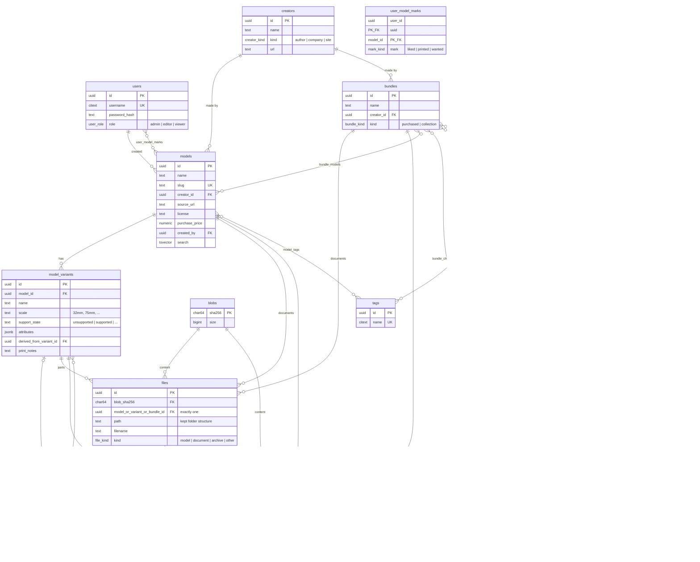

# MySTL — Milestone 1: Core Archive

## Context

Greenfield project (repo contains only `docs/spec.md` and `docs/PROJECT_TEMPLATE.md`).
MySTL is a self-hosted Printables/Thingiverse-style archive for downloaded **and
purchased** 3D models: one central place for models, their variants, files, print
notes, images, and bundles. Backend is Rust/Axum/SQLx (Postgres, with migrations);
frontend is React/TypeScript/MaterialUI via Vite, structured per
`docs/PROJECT_TEMPLATE.md` (single binary serves prod static files or dev-proxies
to Vite; no CORS; clap config with env/flag duality).

### Decisions made with the user

1. **Storage**: content-addressed filesystem blob store (`store/ab/cd/<sha256>`),
   behind a `BlobStore` trait so S3 can be swapped in later. Postgres owns all
   metadata including logical folder structure. Dedup falls out of hash-keying.
2. **Tags vs variants**: two separate systems, unified at the search API. Variants
   are structured children of a model (scale, support state as queryable columns);
   tags are free-form labels on models/bundles. A search like
   `tags=egypt,undead & scale=32mm & support=unsupported` filters models by tags
   and variants by attributes.
3. **Scope**: "core archive first" — the **full** schema lands in migration 0001
   (including jobs, bundles, tags, marks, settings, so it reviews as a whole), but
   this milestone implements: scaffold, auth+roles, blob store, model/variant/file
   upload with zip import, browse/detail UI, tagging, job queue, f3d preview
   rendering. Bundles UI, likes/printed UI, dedup report are fast follow-ups.
4. **Rendering**: shell out to an external tool (f3d first) from a background job —
   no in-project mesh parser/renderer. The renderer command is an **admin-global
   setting**; changing it affects only new renders. Each rendered image records
   the renderer + config that produced it, so an admin can bulk re-render
   "everything still on the previous renderer", choosing **add** (keep old image)
   or **replace**.

> The canonical copy of this plan lives in the repo at `docs/plan.md`.

## Database schema (migration `0001_initial.sql`)

### Entity-relationship diagram



### Table definitions

Postgres, `uuid` PKs (`gen_random_uuid()`), `timestamptz` everywhere, `citext` for
case-insensitive uniques. Enums as Postgres `CREATE TYPE`.

```
-- auth
users            id, username citext UNIQUE, password_hash (argon2id),
                 role user_role ('admin'|'editor'|'viewer'), created_at
                 -- login via signed PrivateCookieJar; no sessions table

-- provenance
creators         id, name, kind creator_kind ('author'|'company'|'site'),
                 url, notes, created_at
                 -- e.g. Loot Studios (company), Printables (site), an author

-- core catalogue
models           id, name, slug UNIQUE, description, creator_id FK NULL,
                 source_url, license text NULL,
                 purchase_price / purchase_date / order_ref NULL,   -- bought models
                 created_by FK users, created_at, updated_at,
                 search tsvector GENERATED (name+description) + GIN index

model_variants   id, model_id FK, name,
                 scale text NULL            -- '32mm', '75mm' … (free text, suggested values)
                 support_state text NULL    -- 'unsupported'|'supported'|'supported_hollow'
                                            -- |'lychee_project'|'merged'|… (CHECKed list + 'other')
                 attributes jsonb DEFAULT '{}',   -- escape hatch for future axes
                 derived_from_variant_id FK NULL, -- user-made variants point at origin
                 print_notes text NULL,           -- per-variant print settings/notes
                 created_by, created_at
                 UNIQUE (model_id, name)

-- content-addressed storage
blobs            sha256 char(64) PK, size bigint, created_at

files            id, blob_sha256 FK blobs,
                 model_id / variant_id / bundle_id  -- exactly one non-null (CHECK)
                 path text        -- kept folder structure ('' = root)
                 filename text, mime text,
                 kind file_kind ('model'|'document'|'archive'|'other'),
                 created_at
                 -- variant files = the printable parts; model/bundle files =
                 -- associated documents (stat guides, painting guides, magazines);
                 -- kind='archive' keeps the original uploaded zip for provenance.
                 -- Duplicate discovery = files joined on shared blob_sha256.

images           id, blob_sha256 FK,
                 model_id / variant_id / bundle_id  -- exactly one non-null (CHECK)
                 kind image_kind ('uploaded'|'imported'|'rendered'),
                 source_file_id FK files NULL,      -- what a render was made from
                 renderer text NULL, renderer_config jsonb NULL,  -- provenance for re-render
                 width, height, is_primary bool, sort_order, created_by, created_at

-- bundles (purchasable packs AND personal uber-bundles)
bundles          id, name, slug, description, creator_id FK NULL, source_url,
                 kind bundle_kind ('purchased'|'collection'), created_by, timestamps
bundle_models    (bundle_id, model_id) PK
bundle_children  (parent_bundle_id, child_bundle_id) PK, CHECK parent<>child

-- tagging
tags             id, name citext UNIQUE
model_tags       (model_id, tag_id) PK
bundle_tags      (bundle_id, tag_id) PK

-- user marks (schema now, UI follow-up)
user_model_marks (user_id, model_id, mark mark_kind ('liked'|'printed'|'wanted')) PK,
                 notes NULL, created_at

-- background jobs
jobs             id bigserial, kind text, payload jsonb,
                 status job_status ('queued'|'running'|'succeeded'|'failed'|'cancelled'),
                 priority int, attempts int, max_attempts int, last_error text,
                 run_after timestamptz, started_at, finished_at, created_at
                 INDEX (status, priority, run_after)

-- admin-global settings
settings         key text PK, value jsonb, updated_at, updated_by
                 -- e.g. 'renderer' → {"tool":"f3d","args":[…]}
```

## Architecture

Follow `docs/PROJECT_TEMPLATE.md` closely:

```
backend/
  src/main.rs          logging, dotenvy, AppState::new, router, worker spawn, serve
  src/config.rs        Arguments (clap, every field flag+env) → Configuration
                       DATABASE_URL, STORE_DIR (default ./store), COOKIE_KEY(+_FILE,
                       required ArgGroup), BIND_ADDR, --dev/VITE_URL/STATIC_DIR,
                       --anonymous (dev auth short-circuit), --create-admin user:pass
  src/state.rs         AppState { config, db: PgPool, store: BlobStore }
  src/extractors.rs    User extractor: PrivateCookieJar → users row; role checks;
                       anonymous short-circuit in dev
  src/routes/
    api.rs             /api/* (utoipa spec, swagger at /docs)
    auth.rs            /auth/register, /auth/login, /auth/logout
    frontend.rs        catch-all: static serve (SPA fallback) or Vite proxy + WS HMR
  src/services/
    blobstore.rs       trait BlobStore { put(stream)->sha256, get(sha)->stream, delete };
                       FsBlobStore: write to tmp, hash while streaming, rename into
                       store/ab/cd/<hash>; GET with range support
    jobs.rs            enqueue(); worker loop: FOR UPDATE SKIP LOCKED poll, retry
                       with backoff, per-kind dispatch
    importer.rs        import_archive job: unzip → hash → create blobs/files
                       preserving paths → enqueue render_preview per model file
    renderer.rs        render_preview job: read 'renderer' setting, shell out to
                       f3d (`f3d --output <png> <stl>` headless), store PNG blob,
                       insert images row stamped with renderer+config
  migrations/0001_initial.sql
  build.rs             APP_VERSION from git describe
frontend/              Vite + React + TS + MUI + react-router + @tanstack/react-query
docker-compose.yml     postgres:17 (+ volume); store/ is a bind-mounted dir
.env.example
```

## API surface (milestone 1)

- `POST /auth/register|login|logout`; `GET /api/me`
- `GET/POST/PUT/DELETE /api/creators`
- `GET/POST/PUT/DELETE /api/models` (+ `?tags=&q=&scale=&support=` unified search)
- `GET/POST/PUT/DELETE /api/models/{id}/variants`
- `POST /api/variants/{id}/files` — multipart upload; a `.zip` triggers an
  `import_archive` job (original archive kept as kind='archive'); others stored
  directly with an optional `path`
- `GET /api/files/{id}/download` (streams from blob store, Content-Disposition)
- `GET/POST /api/models/{id}/images` upload; `GET /api/images/{id}` (serve)
- `GET/POST /api/tags`; tag assignment on model create/update
- `GET /api/jobs?status=` (visibility into queue); `POST /api/jobs/{id}/retry`
- Admin: `GET/PUT /api/admin/settings/renderer`;
  `POST /api/admin/rerender { scope: "stale", mode: "add"|"replace" }` —
  enqueues render jobs for images whose renderer/config ≠ current setting
- Permissions: viewer = read + marks; editor = edit own models/bundles;
  admin = edit all + settings

## Frontend pages (MUI)

**Look & feel: vaguely Printables** (user request). MUI theme with Printables-style
orange primary (~`#FA6831`) on a clean white surface, plus a dark mode variant;
layout mirrors printables.com: top app bar (logo, big centred search, user menu),
model browsing as a dense card grid of large square-ish thumbnails with
name/creator/like-count underneath, and a left filter sidebar (tags, scale,
support state) on the browse page.

- Login/Register
- Model grid: thumbnail cards, text search, tag chips, scale/support filters
- Model detail: image gallery (primary image), variant list with per-variant file
  tree (rebuilt from `path`), download buttons, print notes, tags, creator link
- Model create/edit + upload/import dialog (drag-drop, zip import progress via
  job polling)
- Creators list/detail
- Admin settings page (renderer config + "re-render stale" button with add/replace)

## Implementation order

1. Scaffold backend+frontend per template; docker-compose postgres; `.env.example`;
   verify dev-mode proxy + HMR works end to end.
2. Migration 0001 (full schema above); sqlx offline metadata (`cargo sqlx prepare`).
3. Auth: argon2id, private cookie, User extractor, roles, `--create-admin`,
   `--anonymous` dev short-circuit.
4. `FsBlobStore` + upload/download routes (streaming, never buffering whole files
   in memory — bundles are multi-GB).
5. Creators/models/variants/tags CRUD + unified search query.
6. Job queue worker + `import_archive` job (zip extraction preserving structure).
7. Renderer setting + `render_preview` (f3d shell-out; graceful failure → job
   'failed' with error, model still browsable) + admin re-render endpoint.
8. Frontend pages in the order above.
9. `backend/CLAUDE.md` + top-level `CLAUDE.md` (run instructions), update
   `docs/spec.md` open questions as resolved (or a `docs/decisions.md`).

## Suggestions / gaps in the spec (to record in docs/decisions.md)

Schema above already accommodates these; flagged for the user:

- **License + purchase tracking** on models (price, date, order ref, commercial
  terms) — implied by "models I have bought" but not spec'd.
- **Keep the original archive** as a blob (kind='archive') for provenance/re-import.
- **Import is necessarily staged**: a Loot Studios zip contains many variants, so
  upload → background extract/hash → assignment of folders to variants (heuristic
  prefill from folder names like "32mm/Supported", user-correctable). Milestone 1
  imports a zip into ONE variant; multi-variant classification UI is a follow-up.
- **Model updates**: creators re-release files; `files.created_at` + re-import into
  the same variant covers v1, real versioning deferred.
- **Maintenance jobs**: orphan-blob GC and store integrity re-hash fit the job
  system; deferred but the design allows them.
- **"Printed" is richer than a flag**: printer/resin/exposure/outcome logs —
  `user_model_marks.notes` for now, a `print_logs` table later.
- **Browser import helper** needs token auth (not cookies) — follow-up.

## Verification

- `cargo test` (unit: blobstore hashing/rename, job claim semantics, search query
  building) + `cargo clippy`; `npm run build` clean.
- End-to-end via /verify: `docker compose up -d postgres`; run backend `--dev
  --anonymous` + Vite; then through the real UI/API: register/login (non-anonymous
  run), create creator + model + 32mm/unsupported variant, upload a zip, watch
  import job complete, confirm folder structure and file download round-trips
  byte-identical (hash check), tag it, search by tag+scale+support, upload an
  image; if `f3d` is installed locally, confirm a preview renders and lands in the
  gallery, then change renderer args and use re-render(replace) on the stale image.
- Duplicate check: upload the same STL twice → one blob on disk, two file rows.
